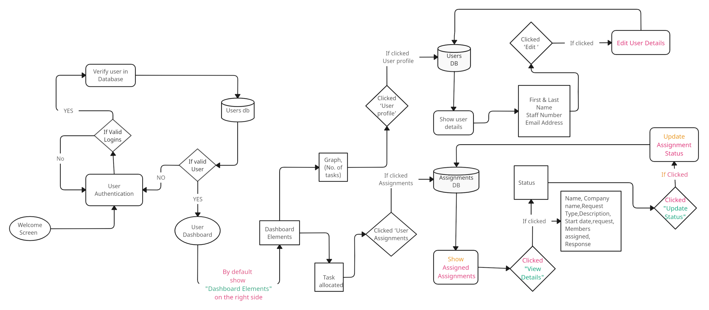

## Collaborators

Thanks to [@Tiffany](https://github.com/RivoltaAlpha) for collaborating on this project!

This project was assigned to us during our attachment at the Ministry of ICT, Kenya, from May to August 2023. Together, we worked on building and enhancing the features to make it a success. Tiffany's valuable contributions and dedication greatly enriched the project, and we're proud to have collaborated with her!

## SYSTEM OVERVIEW (USER SIDE)

Here is the system overview and flow of system,this user side 

## Contributing

Thank you for considering contributing to the Laravel framework! The contribution guide can be found in the [Laravel documentation](https://laravel.com/docs/contributions).

## Code of Conduct

In order to ensure that the Laravel community is welcoming to all, please review and abide by the [Code of Conduct](https://laravel.com/docs/contributions#code-of-conduct).

## License

The Laravel framework is open-sourced software licensed under the [MIT license](https://opensource.org/licenses/MIT).
